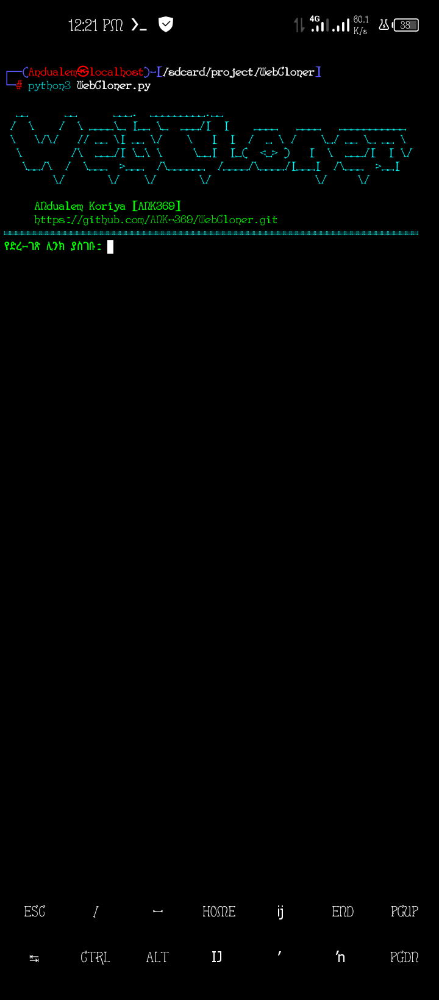

<p align="center">
  
</p>

<h1 align="center">WebCloner</h1>

<p align="center">
  <b>WebCloner</b> - ድረ-ገጾችን በፍጥነት፣ በብቃት እና በጥንቃቄ ለመቅዳት የሚያስችል ፕሮፌሽናል የCommand-Line (CLI) መሣሪያ።
</p>

<p align="center">
  <a href="https://github.com/ANK-369/WebCloner/blob/main/LICENSE">
    
  </a>
  <a href="https://github.com/ANK-369/WebCloner">
    
  </a>
</p>

---

## 📖 ስለ ፕሮጀክቱ (About)
**WebCloner** በተለይ ለደህንነት ምርምር (Security Research)፣ ለትምህርታዊ ዓላማዎች እና ድረ-ገጾችን ከመስመር ውጪ (Offline) ለመጠቀም እንዲረዳ ተደርጎ የተዘጋጀ ነው። ተጠቃሚዎች የድረ-ገጽ ሊንክን በማስገባት ብቻ አጠቃላይ የድረ-ገጹን ይዘት clone ማድረግ እና ራሱ automatically በሚያነሳውው የ PHP ሰርቨር ማየት ይችላሉ።

## ✨ ዋና ዋና ገፅታዎች (Key Features)

* **⚡ ፈጣን Clone:** `wget`ን በመጠቀም ድረ-ገጾችን በፍጥነት ይገለብጣል።
* **🌐 Smart URL Handling:** ሊንኮችን በራስ-ሰር ወደ `http` ወይም `https` በማስተካከል ስህተትን ይቀንሳል።
* **🎭 Browser Simulation:** የፋየርዎል ጥበቃዎችን ለማለፍ እንደ እውነተኛ ብሮውዘር (User-Agent Spoofing) ይሰራል።
* **🚀 ራስ-ሰር ሰርቨር:** ቅጂው እንደተጠናቀቀ በ `localhost:8000` በኩል በራስ-ሰር ያስተናግዳል።
* **🎨 ዘመናዊ ተርሚናል በይነገጽ:** ለተጠቃሚ ምቹ እና ማራኪ በሆነ የቀለም አጠቃቀም የታጀበ ነው።

## 🛠 ቅድመ ሁኔታዎች (Requirements)
ፕሮግራሙ በትክክል እንዲሰራ የሚከተሉት መተግበሪያዎች በተርሚናልዎ ላይ መጫን አለባቸው፡

* **Python 3.x**
* **Wget**
* **PHP** (ሰርቨሩን ለማስጀመር)

## 📥 የመጫኛ መመሪያ (Installation)

1. ፕሮጀክቱን ከGitHub ያውርዱ፡
   ```
   git clone https://github.com/ANK-369/WebCloner.git
   cd WebCloner
   ```

2. ፕሮግራሙን ያሂዱ፡
```
python3 WebCloner.py

```


## 📝 አጠቃቀም (Usage)

ፕሮግራሙ ሲጀመር Clone የሚያደርገውን የድረ-ገጽ ሊንክ (ለምሳሌ፡ `example.com`) ያስገቡ። ፕሮግራሙ በራሱ folder በመፍጠር ፋይሎቹን save እና ሰርቨሩን በራሱ ያስጀምራል።

## ⚠️ ማስጠንቀቂያ (Disclaimer)

ይህ መሣሪያ ለትምህርታዊ እና ለደህንነት ምርምር (Ethical Hacking) ዓላማዎች ብቻ የተዘጋጀ ነው። የሌሎችን ድረ-ገጽ ያለ ፈቃድ መቅዳት እና መጠቀም ህገ-ወጥ ሊሆን ስለሚችል፣ ይህንን መሣሪያ በኃላፊነት እንዲጠቀሙበት በጥብቅ አሳስባለው😎።

## 🤝 አስተዋጽዖ (Contribution)

ማንኛውም አይነት ጥቆማ፣ Bug Report ወይም ማሻሻያ ካለዎት **Pull Request** ወይም **Issue** መክፈት ይችላሉ።

---
